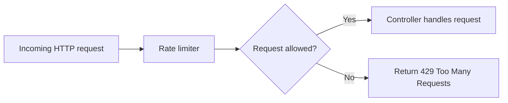
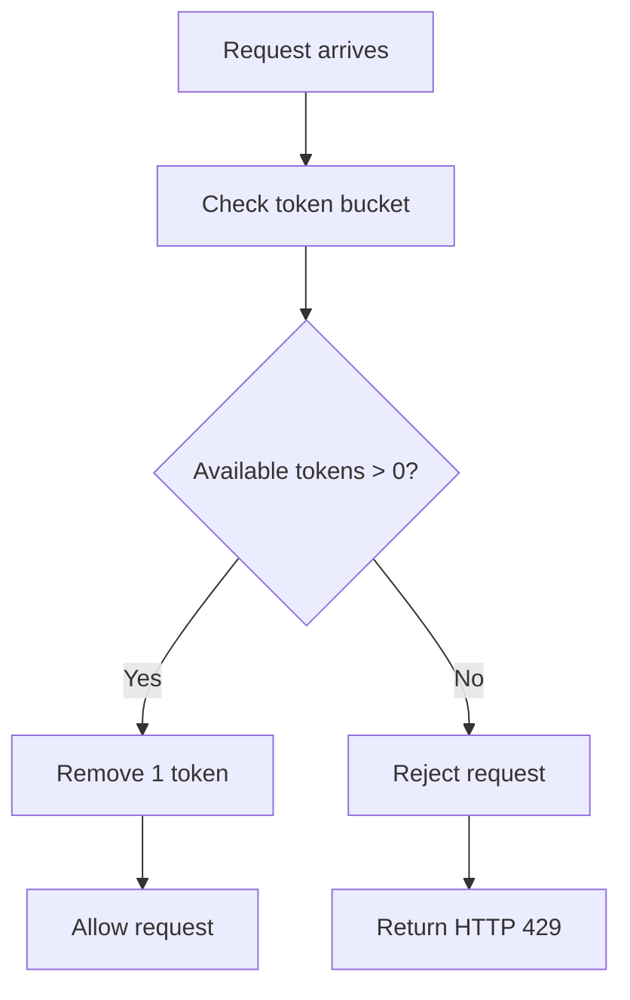
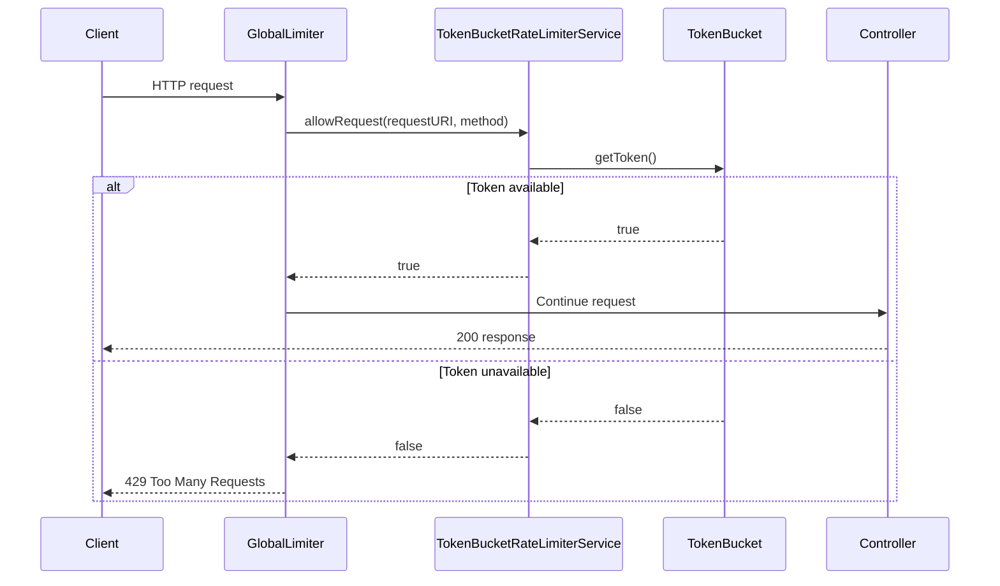

# Rate Limiter Implementation

This project is a Spring Boot implementation of a simple API rate limiter using the token bucket algorithm.

The application exposes two endpoints:

| Method | Endpoint | Limit |
| --- | --- | --- |
| `GET` | `/api/v1/users` | 10 requests per minute |
| `GET` | `/health` | 5 requests per minute |

When a request is allowed, it continues to the controller. When the configured limit is exceeded, the application returns:

```json
{
  "message": "Too many requests"
}
```

with HTTP status `429`.

## 1. What Is a Rate Limiter?

A rate limiter controls how many requests a client or endpoint can make within a specific time period.

Rate limiters are commonly used to:

- Protect services from traffic spikes
- Prevent abuse or brute-force attacks
- Keep API usage fair between clients
- Reduce load on downstream systems such as databases or third-party APIs

For example, if an endpoint allows `10 requests per minute`, the first 10 requests are accepted. Any extra requests within that same minute are rejected until the limit resets or more capacity becomes available.



## 2. How Token Bucket Rate Limiting Works

The token bucket algorithm uses a bucket that holds a fixed number of tokens. Each incoming request must take one token from the bucket before it can proceed.

If the bucket has tokens:

1. A request arrives.
2. One token is removed.
3. The request is allowed.

If the bucket is empty:

1. A request arrives.
2. No token is available.
3. The request is rejected.

After a configured time period, the bucket is refilled.



### Token Bucket Example

Assume `/api/v1/users` has a limit of 10 requests per minute.

```text
Start of minute:
[10 tokens]

After 1 request:
[9 tokens]

After 10 requests:
[0 tokens]

11th request in the same minute:
Rejected with 429

After the refill window passes:
[10 tokens]
```

The main benefit of token bucket rate limiting is that it allows short bursts up to the bucket size while still enforcing an average request rate over time.

## 3. Code Implementation

The implementation is split into four main parts:

| Component | File | Responsibility |
| --- | --- | --- |
| `GlobalLimiter` | `src/main/java/com/daham/ratelimitter/filters/GlobalLimiter.java` | Intercepts every request before it reaches a controller |
| `RateLimiter` | `src/main/java/com/daham/ratelimitter/service/RateLimiter.java` | Defines the rate limiter contract |
| `TokenBucketRateLimiterService` | `src/main/java/com/daham/ratelimitter/service/TokenBucketRateLimiterService.java` | Stores route limits and checks buckets |
| `TokenBucket` | `src/main/java/com/daham/ratelimitter/Entitiy/TokenBucket.java` | Tracks available tokens for one route |

### Request Flow



### `GlobalLimiter`

`GlobalLimiter` extends Spring's `OncePerRequestFilter`, so it runs once for each HTTP request.

It extracts:

- `request.getRequestURI()`
- `request.getMethod()`

Then it calls:

```java
rateLimiter.allowRequest(request.getRequestURI(), request.getMethod())
```

If the result is `true`, the request continues:

```java
filterChain.doFilter(request, response);
```

If the result is `false`, the filter stops the request and returns `429`:

```java
response.setStatus(429);
response.setContentType("application/json");
response.getWriter().write("{\"message\":\"Too many requests\"}");
```

### `RateLimiter`

`RateLimiter` is a simple interface:

```java
public interface RateLimiter {
    boolean allowRequest(String requestURI, String method);
}
```

This keeps the filter decoupled from the specific rate limiting algorithm. The current implementation uses token bucket, but another implementation could use fixed window, sliding window, or leaky bucket.

### `TokenBucketRateLimiterService`

`TokenBucketRateLimiterService` defines the configured rate limit rules:

```java
private final Map<String, Integer> rateLimitRules = Map.of(
        "GET:/api/v1/users", 10,
        "GET:/health", 5
);
```

Each key is built from:

```text
HTTP_METHOD:REQUEST_PATH
```

Examples:

```text
GET:/api/v1/users
GET:/health
```

At startup, the service creates one `TokenBucket` for each rule:

```java
entry -> new TokenBucket(
        entry.getValue(),
        entry.getValue(),
        entry.getKey(),
        now
)
```

That means each configured endpoint gets:

- `maxTokenPerMinute`: the route limit
- `availableTokens`: initially equal to the route limit
- `key`: the method and path key
- `lastUpdateTime`: the time the bucket was created

When a request arrives, the service finds the matching bucket and asks it for a token:

```java
return tokenBuckets.get(method + ":" + requestURI).getToken();
```

### `TokenBucket`

`TokenBucket` holds the current token state for one endpoint.

```java
private int maxTokenPerMinute;
private int availableTokens;
private String key;
private long lastUpdateTime;
```

The important method is:

```java
public boolean getToken()
```

It first checks whether more than 60 seconds have passed:

```java
if (System.currentTimeMillis() - lastUpdateTime > 60_000) {
    availableTokens = maxTokenPerMinute;
}
```

In the current code, `lastUpdateTime` is not updated after this refill. That means once the bucket is older than 60 seconds, each later request will refill the bucket before checking the token count. For a stricter production implementation, `lastUpdateTime` should be updated when the bucket is refilled.

Then it checks whether a token is available:

```java
if (availableTokens > 0) {
    availableTokens -= 1;
    return true;
}
return false;
```


## Running the Application

Run the application with Gradle:

```bash
./gradlew bootRun
```

Then call the endpoints:

```bash
curl http://localhost:8080/api/v1/users
curl http://localhost:8080/health
```

To test the limiter quickly, call the same endpoint more times than its configured limit within one minute.

Example for `/health`, which allows 5 requests per minute:

```bash
for i in {1..6}; do curl -i http://localhost:8080/health; echo; done
```

The 6th request should return `429 Too Many Requests`.

## Current Behavior Notes

- While this project implements a simple rate limitter, its is not recommended to use this apraoch in a production system
- Having token buckets in memory can gradually increase the heap memory usage
- This design is not recommended for a destributed architecture 
- Race conditions can occur when two requests trying to access the same token bucket at the same time. 

## To address these issues, you can use Redis as a destributed cache and use destributed locks to prevent race conditions, 